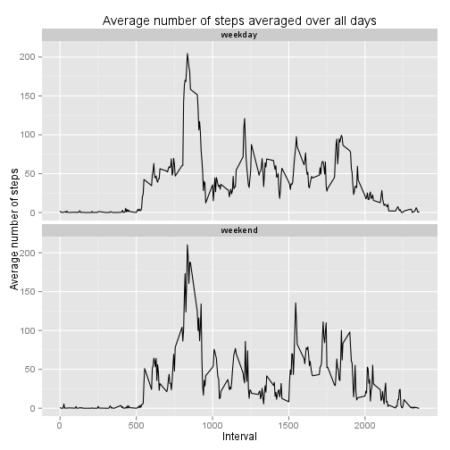

## Loading and preprocessing the data
Show any code that is needed to 

1. Load the data (i.e. read.csv())


  
  ```r
  # unzip the zip file and then load the data 
  unzip("activity.zip")
  data <- read.csv("activity.csv", sep=",", header = TRUE)
  ```

2. Process/transform the data (if necessary) into a format suitable for your analysis

  
  ```r
  # omit any rows that contain NA values, in order to do calculations smoothly
  data2 <- na.omit(data)
  # convert date column values to dates
  data$date <-as.Date(data$date, format="%Y-%M-%d")
  ```


## What is mean total number of steps taken per day?

For this part of the assignment, you can ignore the missing values in the dataset.

1. Make a histogram of the total number of steps taken each day

  
  ```r
  #aggregate steps by date
  aggregateStepsByDate <- aggregate(steps ~ date, data2, sum)
  hist(aggregateStepsByDate$steps, col=1, main="Histogram of total number of steps taken each day", 
      xlab="Total number of steps taken a day")
  ```
  
   

2. Calculate and report the mean and median total number of steps taken per day

  
  ```r
  mean(aggregateStepsByDate$steps)
  ```
  
  ```
  ## [1] 10766.19
  ```
  
  ```r
  median(aggregateStepsByDate$steps)
  ```
  
  ```
  ## [1] 10765
  ```


## What is the average daily activity pattern?

1. Make a time series plot (i.e. type = "l") of the 5-minute interval (x-axis) and the average number of steps taken, averaged across all days (y-axis)
  
  ```r
  #aggregate steps by interval
  aggregateStepsByInterval <- aggregate(steps ~ interval, data2, mean)
  plot(aggregateStepsByInterval$interval, aggregateStepsByInterval$steps, type='l', col=1, 
      main="Average number of steps averaged over all days", xlab="Interval", 
      ylab="Average number of steps")
  ```
  
   
  
2. Which 5-minute interval, on average across all the days in the dataset, contains the maximum number of steps?
  
  
  ```r
    #find which interval has the maximum number of steps
    aggregateStepsByInterval[which.max(aggregateStepsByInterval$steps),]
  ```
  
  ```
  ##     interval    steps
  ## 104      835 206.1698
  ```


## Imputing missing values

Note that there are a number of days/intervals where there are missing values (coded as NA). The presence of missing days may introduce bias into some calculations or summaries of the data.

1. Calculate and report the total number of missing values in the dataset (i.e. the total number of rows with NAs)
  
  
  ```r
  colSums(is.na(data))[1]
  ```
  
  ```
  ## steps 
  ##  2304
  ```
  
2. Devise a strategy for filling in all of the missing values in the dataset. The strategy does not need to be sophisticated. For example, you could use the mean/median for that day, or the mean for that 5-minute interval, etc.

  
  ```r
  # replace all the NA with the mean of the corresponding 5-min interval
  for (i in 1:nrow(data)){
      if (is.na(data$steps[i])){
  	    myInterval <- data$interval[i]
  	    replaceWith <- aggregateStepsByInterval$steps[which(aggregateStepsByInterval$interval == myInterval)]
  	    data$steps[i] <- replaceWith
      }
  }
  ```
3. Create a new dataset that is equal to the original dataset but with the missing data filled in.

  
  ```r
  aggregateStepsByDateAll <- aggregate(steps ~ date, data, sum)
  ```
4. Make a histogram of the total number of steps taken each day and Calculate and report the mean and median total number of steps taken per day. Do these values differ from the estimates from the first part of the assignment? What is the impact of imputing missing data on the estimates of the total daily number of steps?
  
  ```r
    hist(aggregateStepsByDateAll$steps, col=1, main="Histogram of total number of steps taken each day", 
  	xlab="Total number of steps taken a day")
  ```
  
   
  
  ```r
    mean(aggregateStepsByDateAll$steps)
  ```
  
  ```
  ## [1] 21185.08
  ```
  
  ```r
    median(aggregateStepsByDateAll$steps)
  ```
  
  ```
  ## [1] 21641
  ```


## Are there differences in activity patterns between weekdays and weekends?

For this part the weekdays() function may be of some help here. Use the dataset with the filled-in missing values for this part.

1. Create a new factor variable in the dataset with two levels – “weekday” and “weekend” indicating whether a given date is a weekday or weekend day.

  
  ```r
  weekend <- c("Saturday", "Sunday")
  # extra column containing whether the day of each date is in the weekend vector
  data$weekday <- weekdays(as.Date(data$date, format="%Y-%M-%d")) %in% weekend
  # replace the TRUE/FALSE values with weekend/weekday respectively
  data$weekday[data$weekday == TRUE] <- "weekend"
  data$weekday[data$weekday == FALSE] <- "weekday"
  ```
2. Make a panel plot containing a time series plot (i.e. type = "l") of the 5-minute interval (x-axis) and the average number of steps taken, averaged across all weekday days or weekend days (y-axis). See the README file in the GitHub repository to see an example of what this plot should look like using simulated data.

  
  ```r
  # aggregate by interval and weekday
  aggregateStepsByIntervalWeekday <- aggregate(steps ~ interval+weekday, data, mean)
  
  # we are gonna need the ggplot2 for that
  library(ggplot2)
  qplot(interval, steps, data=aggregateStepsByIntervalWeekday, geom=c("line"), 
      main="Average number of steps averaged over all days", xlab="Interval", 
      ylab="Average number of steps") + facet_wrap(~ weekday, ncol=1)
  ```
  
   
